<div align="center">

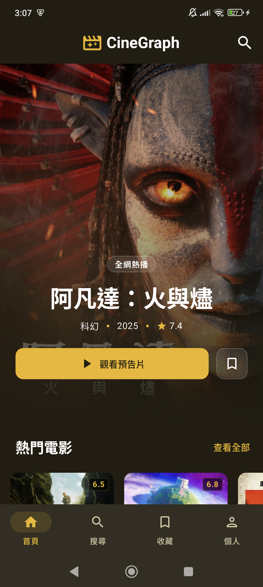

# CineGraph

> 以電影為核心的 Android 應用程式，採用 **Clean Architecture + MVI** 架構設計，  
> 串接 TMDB API 實現完整的電影探索、收藏與個人化體驗。

[](https://kotlinlang.org/)
[](https://developer.android.com/jetpack/compose)
[](https://dagger.dev/hilt/)
[](https://developer.android.com/studio/releases/platforms)

</div>

---

## 功能亮點

| 功能 | 說明 |
|------|------|
| 首頁探索 | Hero 全版橫幅（當日趨勢）、熱門電影橫向列表、現正熱映 Banner、「為你推薦」無限捲動格狀列表（最多 10 頁）|
| 搜尋 | 全文搜尋＋無限捲動結果、搜尋歷史（最多 10 筆、可逐條刪除）、分類 Chip 快速篩選（7 種類型）|
| 電影詳情 | Backdrop 預告片播放、完整元資料、演員陣容、TMDB 用戶評分、類似電影推薦（依片種篩選，最多 10 頁）|
| 我的收藏 | Room 本地快取（離線優先）+ TMDB 雲端同步；樂觀 UI 切換；防連點保護 |
| 個人中心 | 主題切換（亮色 / 暗色 / 跟隨系統）、語言切換（繁體中文 / English）、快取管理、登出 |
| 身分驗證 | TMDB OAuth v3 via Custom Chrome Tab；Deep Link 回調；訪客模式（不需登入即可瀏覽）|
| 骨架屏 | 所有載入狀態皆配置 Shimmer Skeleton；各區塊獨立 Error UI + 重試按鈕 |
| 多語系 | 繁體中文 / English 雙語，所有字串以 `stringResource` 管理，無 hardcoded 文字 |

---

## 系統截圖

<div align="center">

### 首頁

<table>
  <tr>
    <td></td>
    <td>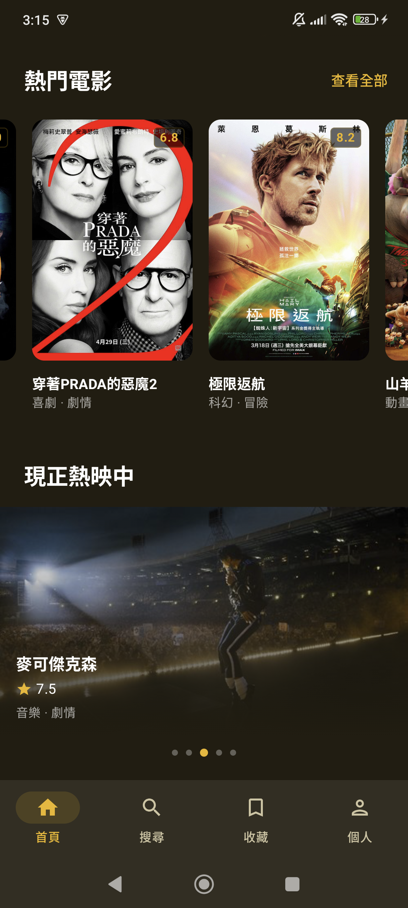</td>
    <td>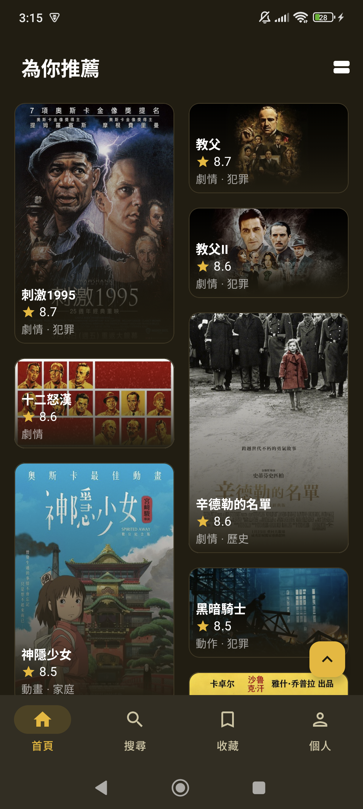</td>
    <td>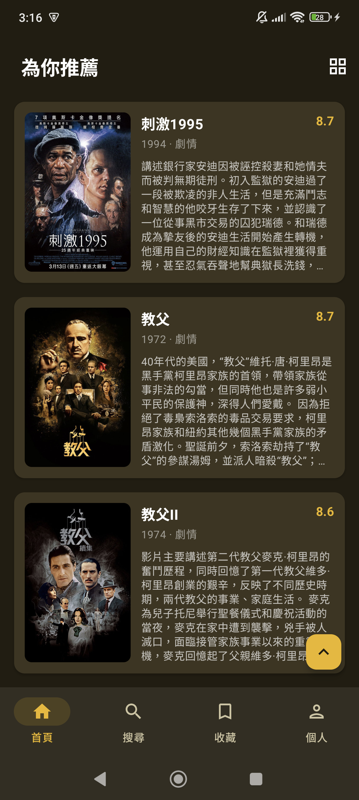</td>
  </tr>
  <tr>
    <td align="center">Hero Section</td>
    <td align="center">熱門 & 現正熱映</td>
    <td align="center">為你推薦（格狀）</td>
    <td align="center">為你推薦（列表）</td>
  </tr>
</table>

### 搜尋

<table>
  <tr>
    <td>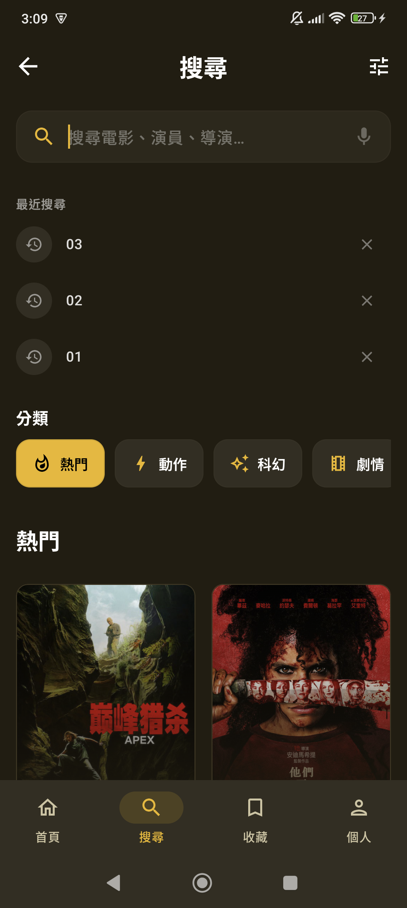</td>
    <td>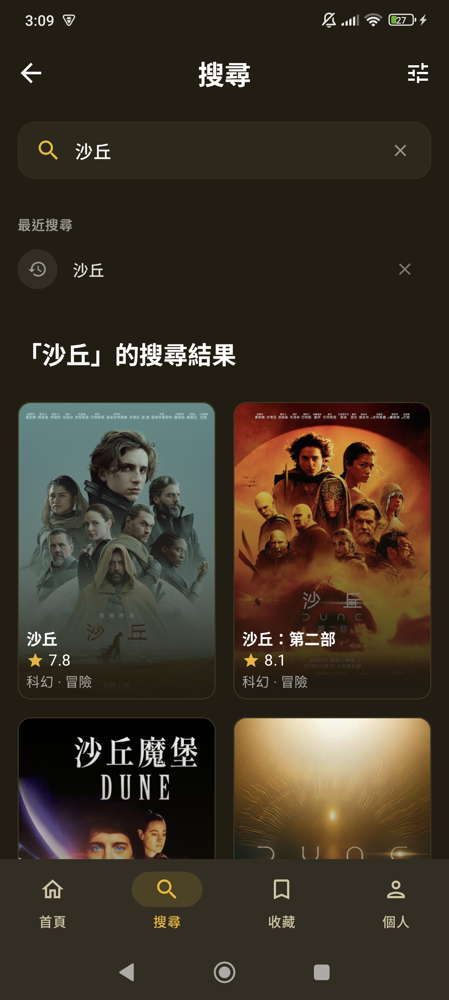</td>
  </tr>
  <tr>
    <td align="center">分類瀏覽 & 搜尋歷史</td>
    <td align="center">搜尋結果</td>
  </tr>
</table>

### 電影詳情

<table>
  <tr>
    <td>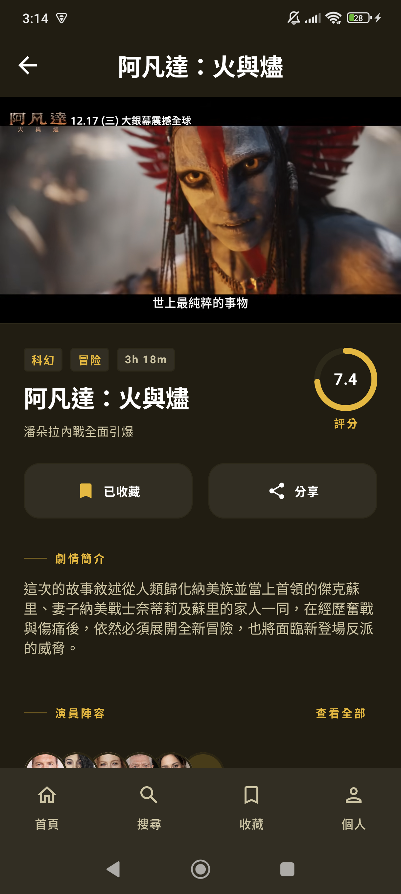</td>
    <td>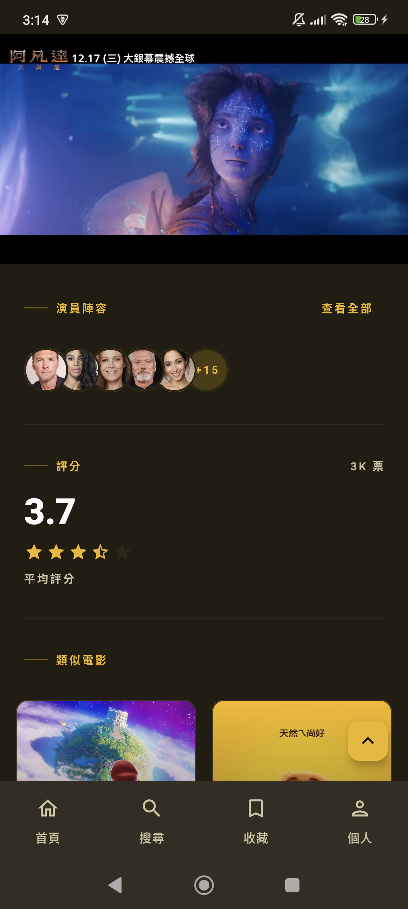</td>
  </tr>
  <tr>
    <td align="center">基本資訊 & 操作</td>
    <td align="center">演員 / 評分 / 類似電影</td>
  </tr>
</table>

### 收藏 & 個人中心

<table>
  <tr>
    <td>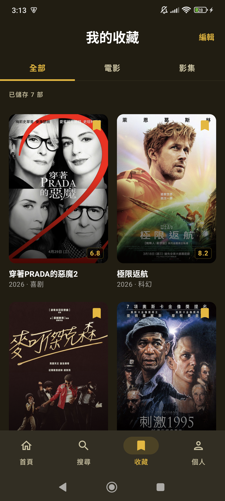</td>
    <td>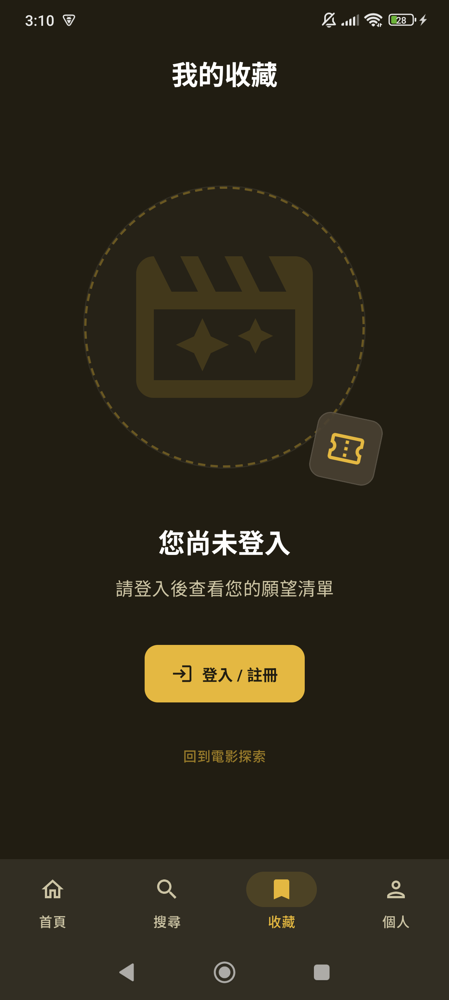</td>
    <td>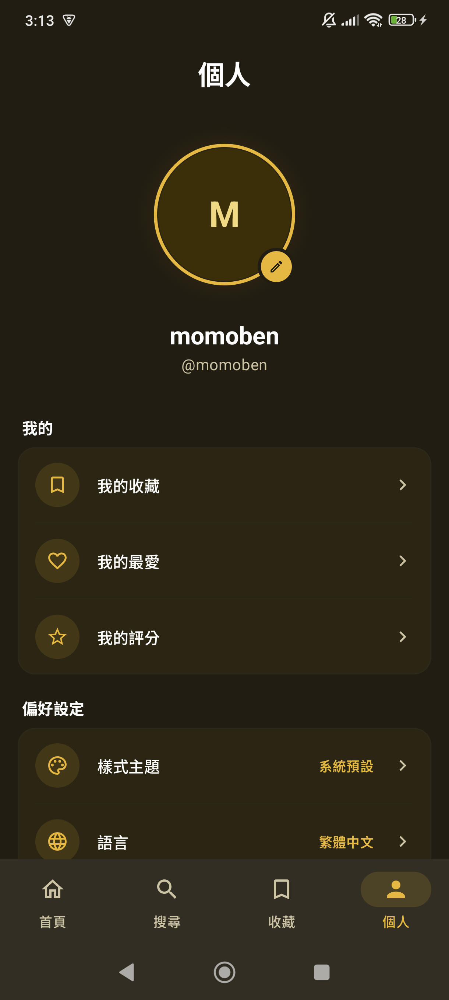</td>
    <td>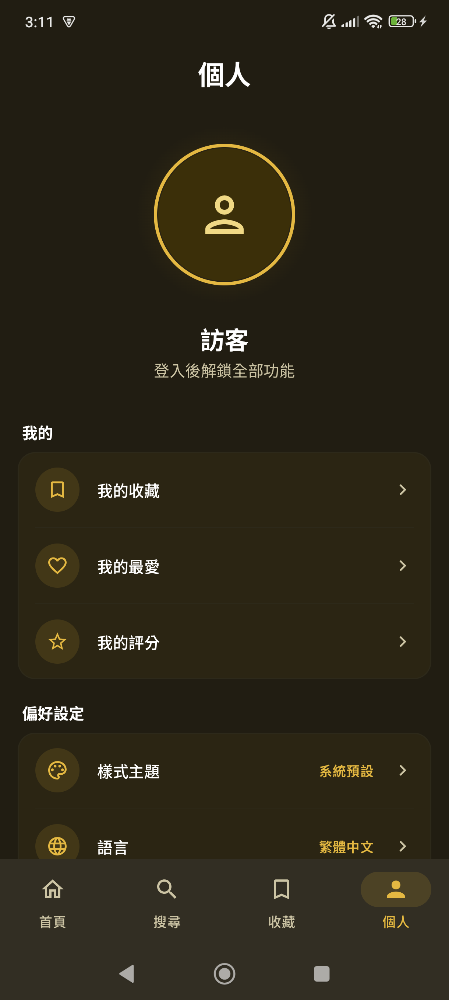</td>
  </tr>
  <tr>
    <td align="center">我的收藏（已登入）</td>
    <td align="center">我的收藏（訪客）</td>
    <td align="center">個人中心（已登入）</td>
    <td align="center">個人中心（訪客）</td>
  </tr>
</table>

### 登入

<table>
  <tr>
    <td>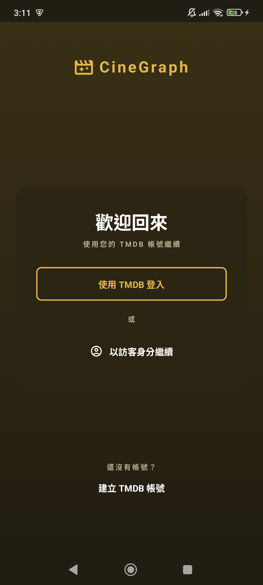</td>
  </tr>
  <tr>
    <td align="center">TMDB OAuth 登入</td>
  </tr>
</table>

</div>

---

## 展示影片

| 首頁 | 搜尋 | 收藏 |
|:----:|:----:|:----:|
| 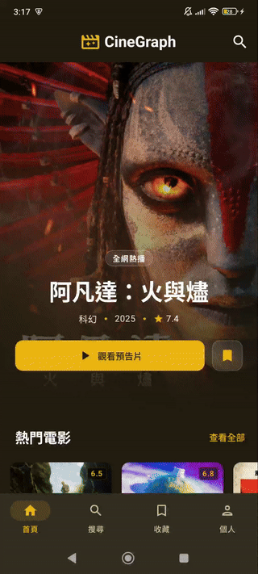 | 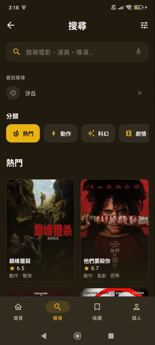 | 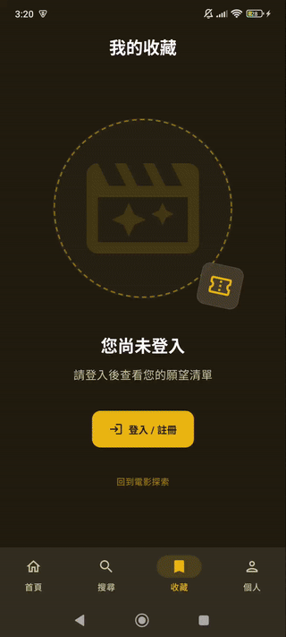 |

| 個人中心 | 多語系切換 | 亮色主題 |
|:-------:|:---------:|:-------:|
| 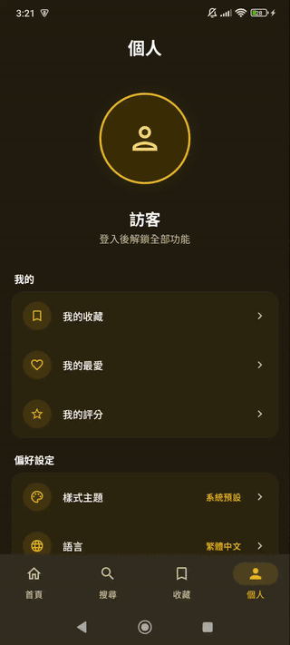 | 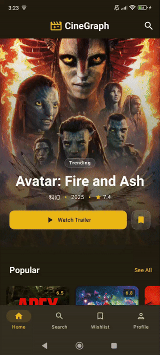 | 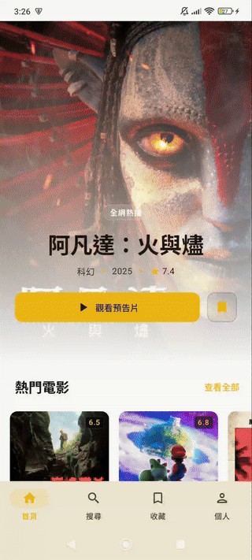 |

---

## 技術架構

### 技術棧

| 類別 | 使用技術 |
|------|---------|
| 語言 | Kotlin 2.0.21 |
| UI 框架 | Jetpack Compose · Material 3 · Coil 2.6.0（圖片載入）|
| 架構模式 | Clean Architecture · MVI · Single Activity |
| 非同步處理 | Kotlin Coroutines · StateFlow |
| 依賴注入 | Hilt 2.51.1 |
| 網路層 | Retrofit 2.9.0 · OkHttp（API Key Interceptor）|
| 本地資料庫 | Room（收藏清單離線快取）|
| 偏好設定 | Jetpack DataStore（主題 / 語言）· EncryptedSharedPreferences（Session Token）|
| 身分驗證 | TMDB OAuth v3 · Custom Chrome Tab · Deep Link |
| 影片播放 | AndroidYouTubePlayer |
| 建置設定 | minSdk 24 · targetSdk 36 · compileSdk 36 · Java 11 |

### 專案結構

```
com.example.cinegraph/
├── data/
│   ├── repository/        # Repository 實作（含 Result<T> 錯誤處理）
│   ├── source/remote/     # Retrofit API 定義 + Response DTO
│   ├── source/local/      # Room DAO + Entity
│   └── mapper/            # DTO → Domain Model 映射
├── domain/
│   ├── model/             # 純 Kotlin Domain Model（無 Android 依賴）
│   ├── repository/        # Repository 介面（依賴反轉）
│   └── usecase/           # 單一職責 UseCase（每個操作一個類別）
└── presentation/
    ├── viewmodel/         # Hilt ViewModel，處理 UiEvent → UiState
    ├── ui/
    │   ├── screen/        # 狀態提升 Screen Composable（只接收 uiState + onEvent）
    │   ├── components/    # 可複用元件（Slot API 設計）
    │   └── state/         # UiState · UiEvent · UiEffect（各 Screen 獨立定義）
    └── navigation/        # NavHost + Screen sealed class
```

### MVI 資料流

```
用戶操作
   ↓
UiEvent（sealed interface）
   ↓
ViewModel.onEvent()
   ↓                ↘
UiState（StateFlow）  UiEffect（Channel，一次性：導航、Snackbar）
   ↓
Screen Composable（無業務邏輯，純渲染）
```

每個 Screen 皆具備三個獨立定義：

| 類型 | 職責 |
|------|------|
| `sealed interface XxxUiState` | `Loading` / `Success` / `Error` 三態 |
| `sealed interface XxxUiEvent` | 集中所有用戶操作，杜絕散落的 callback |
| `sealed interface XxxUiEffect` | 導航跳轉、Snackbar 等一次性副作用 |

---

## 快速開始

### 環境需求

- Android Studio Hedgehog 以上
- [TMDB API Key](https://www.themoviedb.org/settings/api)（免費申請）

### 設定步驟

1. Clone 專案
   ```bash
   git clone https://github.com/your-username/CineGraph.git
   ```

2. 在 `local.properties` 加入 API Key
   ```properties
   TMDB_API_KEY=your_api_key_here
   ```

3. 使用 Android Studio 執行（模擬器或實體裝置，API 24+）

---

## 資料來源聲明

本應用程式使用 [TMDB API](https://www.themoviedb.org/) 提供電影資料，但本專案與 TMDB 無任何隸屬或背書關係。

---

<div align="center">
  林秉毅 Bing-Yi Lin
</div>
